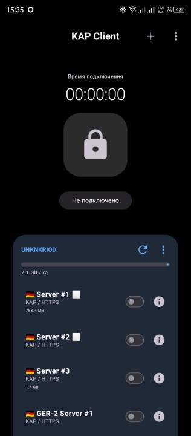
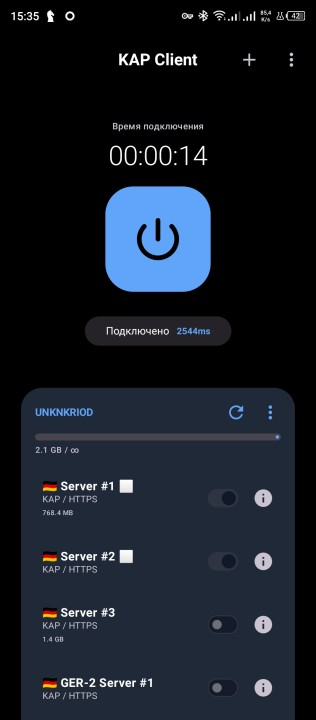
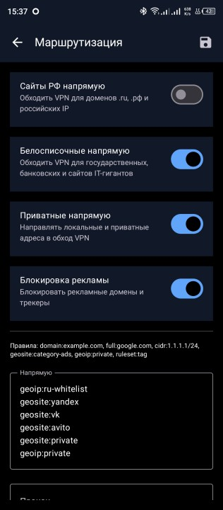
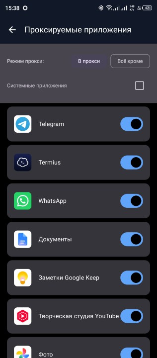
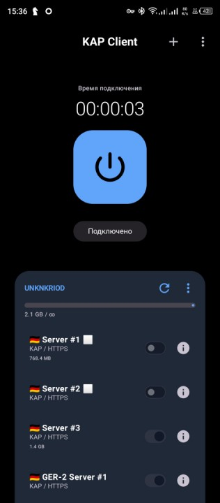
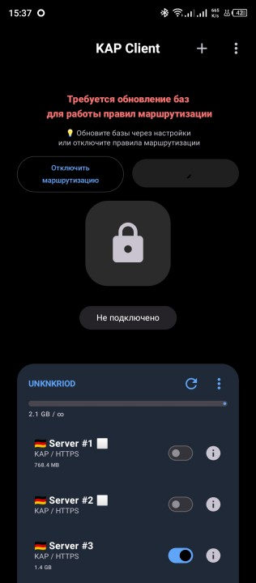
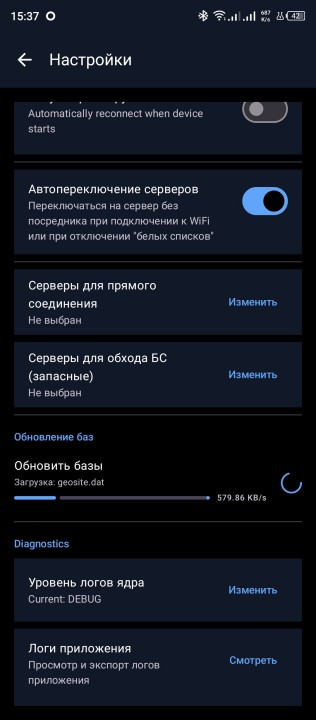
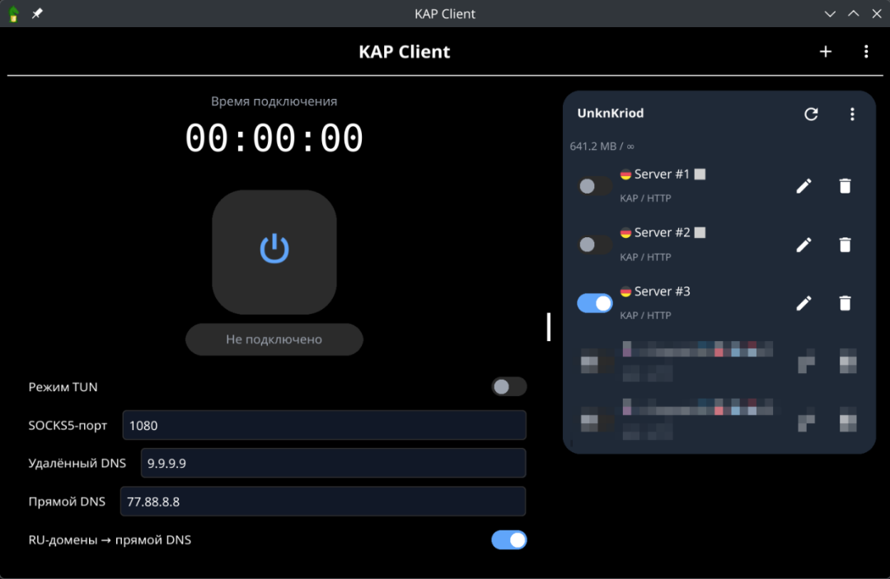
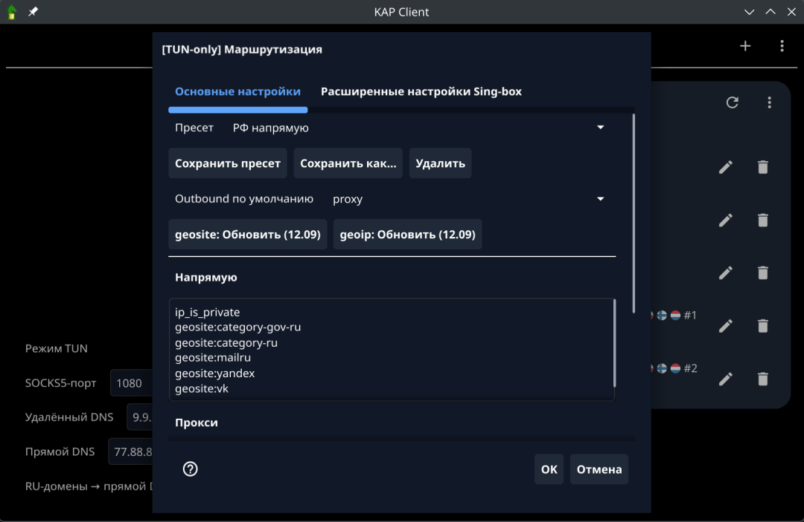
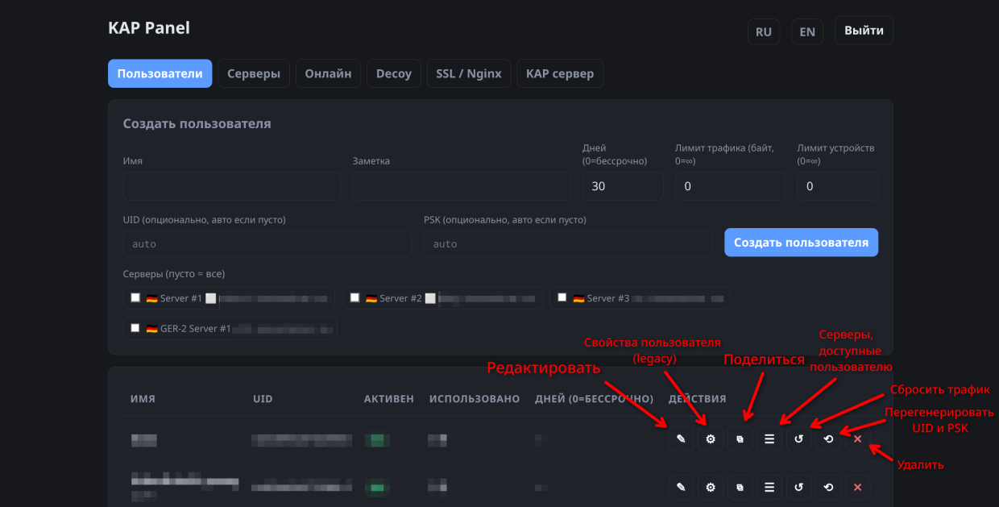

# KAP

**В релизах** — готовые бинарники сервера, панели и клиентов.

**В этом репозитории** открыты:
- исходный код **Android-клиента**;
- скрипты установки сервера (`deploy/`);
- decoy-страницы.

Исходный код **сервера, панели и ПК-клиентов (CLI/GUI) не публикуется** — только бинарники.

PR по Android-клиенту и скриптам приветствуются.

---

## Что входит

| Файл | Назначение |
|------|------------|
| `kap-panel` | Панель управления + KAP на одном сервере |
| `kap-server` | Отдельный KAP-узел (без панели) |
| `kap-client` | Клиент для ПК (SOCKS5) |
| `kap-client-gui` | Клиент с графическим интерфейсом (если есть в релизе) |
| `deploy/install.sh` | Установка на Linux-сервер |
| `deploy/uninstall.sh` | Удаление |
| `decoy/` | Заглушки для «чужих» посетителей сайта |

Клиент для Android — отдельное приложение.

---

## Установка на сервер (Linux)

Нужен VPS с **root** (или `sudo`), желательно Ubuntu/Debian. Для HTTPS используется **nginx**. Нужны `curl` или `wget` (для загрузки с GitHub) и `tar`.

### 1. Установка

```bash
sudo apt install curl nginx certbot tar
curl -fsSL https://github.com/UnknKriod/kap/releases/latest/download/install.sh | sudo bash
```

Скрипт спросит:

1. **Режим**
   - **1 — all-in-one** — панель и KAP на одной машине (рекоммендуется)
   - **2 — server-only** — только KAP (второй сервер / edge; панель на другой машине)
2. **Источник бинарников**
   - **1 — GitHub** — скачать релиз с GitHub
   - **2 — Local** — взять уже лежащие файлы из `bin/` рядом со скачанным скриптом (команда запуска выше не подходит для этого)
3. Адреса прослушивания (можно оставить значения по умолчанию)
4. Для all-in-one — публичный URL для клиентов и **пароль администратора**

По умолчанию ставится в `/opt/kap`, создаётся пользователь `kap` и unit **systemd**.

На сервер ставятся только `kap-panel` / `kap-server`.

Установщик скачает нужные `*-linux-<arch>` под архитектуру сервера.

### 2. Запуск службы

```bash
# панель + KAP
sudo systemctl status kap-panel
sudo systemctl enable --now kap-panel

# только edge-сервер
sudo systemctl status kap-server
sudo systemctl enable --now kap-server
```

Логи:

```bash
sudo journalctl -u kap-panel -f
# или
sudo journalctl -u kap-server -f
```

### 3. Откройте панель

После all-in-one панель слушает порт, который вы указали (дефолт `8080`).

В браузере:

```text
http://IP_СЕРВЕРА:8080/kap-panel/
```

Войдите с паролем администратора из установщика. При первом входе откроется мастер настройки (домен, порты, SSL, firewall).

Дальше в панели:

1. Добавьте **сервер(а)** (домен, TLS, при необходимости «за CDN»)
2. Создайте **пользователя** (срок, лимит трафика)
3. Скопируйте команду клиента, ссылку `kap-proxy://…` или **подписку**

### 4. Nginx с HTTPS

1. В панели откройте **SSL / Nginx**, укажите домены и пути к сертификатам.
2. Нажмите применение конфига.
3. Убедитесь, что в nginx подключён сгенерированный файл (установщик должен добавить `include` сам). Пример:

```nginx
http { 
  ...
  include /opt/kap/data/nginx-kap.conf;
}
```

5. Проверьте и перезагрузите nginx:

```bash
sudo nginx -t && sudo systemctl reload nginx
```

Панель снаружи обычно доступна как:

```text
https://ваш-домен/kap-panel/
```

KAP для клиентов — на домене, который вы назначили серверу.

### Удаление

```bash
curl -fsSL https://github.com/UnknKriod/kap/releases/latest/download/uninstall.sh | sudo bash
```

Можно оставить или удалить каталог `/opt/kap` и настройки nginx — скрипт спросит.

---

## Клиенты

### Графический клиент (GUI)

1. Скачайте `kap-client-gui` для своей ОС из релизов.
2. Добавьте подписку (URL из панели) или вручную сервер / ссылку.
3. Отметьте галочками серверы для балансировки (если их несколько).
4. Подключитесь (SOCKS5 или TUN, если доступен).

На Windows режим TUN обычно требует **запуск от имени администратора**.

**Windows-клиент в полной мере не был протестирован, в отличие от Linux-клиента.**

### CLI-клиент

**Можно скопировать из панели.** У клиента есть кнопка с иконкой шестерни, которая откроет всю информацию, включая команду запуска CLI-клиента)

Пример:

```bash
KAP_PSK=ВАШ_PSK ./kap-client -server https://cdn.example.com -uid ВАШ_UID -socks 127.0.0.1:1080
```

Несколько серверов — повторите флаг `-server`:

```bash
KAP_PSK=ВАШ_PSK ./kap-client -server https://cdn-a.example.com -server https://cdn-b.example.com -uid ВАШ_UID -socks 127.0.0.1:1080
```

Если перед сервером стоит CDN, добавьте `-behind-cdn`.

Проверка:

```bash
curl -s --socks5-hostname 127.0.0.1:1080 https://ifconfig.me
```

### Подписка и мобильное приложение

В панели у пользователя есть подписка и QR / ссылки вида `kap-proxy://…`.

URL подписки (путь настраивается в панели, желательно что-то безобидное типа "getKey"):

```text
https://панель-домен/kap-panel/<путь>/<токен>
```

Импортируйте его в клиент — подтянутся серверы, трафик и срок.

---

## Сценарии

### Один VPS

1. `install.sh` → режим **1 (all-in-one)**
2. Домен + SSL + nginx
3. Пользователи в панели
4. Клиенты по подписке или команде

### Панель и отдельный KAP

1. На машине с панелью — **all-in-one**.
2. На edge — **server-only**, общая база или пользователи.
3. В панели заведите несколько серверов и привяжите их к пользователям.

### 2 сервера с панелью на каждом

1. В панели второго сервера получить подписку пользователя (или ссылку на сервер формата `kap-proxy://`)
2. В панели основного сервера подключить эту подписку как дополнительную

---

## Скриншоты

### Android

| Нет выбранных серверов | Работает | Маршрутизация |
|:--------:|:----------------------:|:-------------:|
|  |  |  |

| Split-tunneling | До автопереключения | После автопереключения |
|:---------------:|:-------------------:|:----------------------:|
|  |  |  |

| Нужно обновить БД | Обновление БД |
|:-----------------:|:-------------:|
|  |  |

### Desktop (GUI)

| Главный экран | Маршрутизация |
|:-------------:|:-------------:|
|  |  |

### Панель

| Главный экран |
|:-------------:|
|  |

---

## Частые вопросы

### Панель открывается, клиент не коннектится
Проверьте домен KAP, SSL, nginx, что в панели сервер **enabled**, пользователь не истёк и не превысил лимит. Сверьте URL `-server` с доменом KAP, не с путём панели.

### Панель не открывается
1. Проверьте фаервол (iptables/nftables/ufw).
2. Проверьте запущены ли сервисы kap-panel и nginx:
```bash
sudo systemctl status kap-panel
sudo systemctl status nginx
```
3. Проверьте подключён ли конфиг nginx панели в /etc/nginx/nginx.conf как указано в пункте 4 инструкции по установке выше.

### После CDN обрывы / странные ошибки
В карточке сервера включите режим за CDN; на клиенте обновите подписку или вручную добавьте `-behind-cdn`.

### Windows: Access is denied в TUN
Запустите GUI от администратора или подтвердите UAC.

---

## 🖥️ Готовые сервера

За **150 ₽/мес** вы получите несколько серверов с обходом "белых списков" ("глушилок") и поддержку.

Предоставляется 14-дневный пробный период.

Писать в ТГ: https://t.me/kap_proxy?direct

Своя установка по инструкции выше — бесплатно.

---

## Лицензия

| Компонент | Что доступно | Условия |
|-----------|--------------|---------|
| Сервер, панель, CLI/GUI (ПК) | Только бинарники | Проприетарная лицензия: личное использование бесплатно; коммерция — с указанием «Powered by KAP» и ссылкой на этот репозиторий |
| Android-клиент, `deploy/`, `decoy/` | Исходники в этом репозитории | Можно смотреть и предлагать PR; коммерческое использование тех же правил attribution, если вы распространяете KAP как продукт |

Полный текст: [`LICENSE.txt`](LICENSE.txt).
